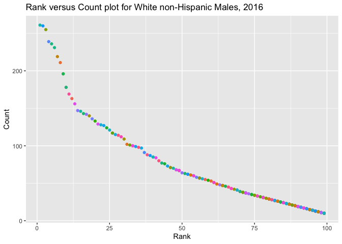

P8105\_HW2\_if2282
================
Ifrah Fayyaz

``` r
library(tidyverse)
library(readxl)
```

# Problem 1

## Reading Mr. Trash Wheel Dataset:

``` r
trash_wheel = 
  read_excel(
    "data/Trash-Wheel-Collection-Totals-8-6-19.xlsx",
    sheet = "Mr. Trash Wheel",
    skip = 1
    ) %>%
  janitor::clean_names() %>%
  na.omit() %>%
  mutate(sports_balls = round(sports_balls, digits = 0)) %>%
  mutate(homes_powered = round(homes_powered, digits = 0))
```

*Description:* The dataset for Mr. Trashwheel contains 17 variables and
0 observations. The median number of sports balls in a dumpster in 2017
were NA. The mean weight of trash accumulated by Mr. Trashweel in 2014
was NaN tons.

## Reading Precipiation Datasets for 2018 and 2019:

``` r
precipitation_2018 = 
  read_excel(
    "data/Trash-Wheel-Collection-Totals-8-6-19.xlsx",
    sheet = "2018 Precipitation",
    skip = 1
  ) %>%
  janitor::clean_names() %>%
  na.omit() %>%
  mutate(year = "2018")

precipitation_2019 = 
  read_excel(
    "data/Trash-Wheel-Collection-Totals-8-6-19.xlsx",
    sheet = "2019 Precipitation",
    skip = 1
  ) %>%
  janitor::clean_names() %>%
  na.omit() %>%
  mutate(year = "2019")

precipitation =
  bind_rows(precipitation_2018, precipitation_2019) %>%
  mutate(month = month.name[month])
```

*Description:* The dataset of Precipitation contains 3 variables and 18
observations. The total precipitation in the year 2018 was 70.33 and
16.67 in 2019.

# Problem 2

``` r
pol_months = 
  read_csv("data/fivethirtyeight_datasets/pols-month.csv") %>%
  separate(mon, sep = '-', into = c("year", "month", "day")) %>%
  mutate(month = month.abb[as.numeric(month)]) %>%
  mutate(president = recode(prez_dem, "1" = "Democrat", "0" = "Republican")) %>%
  select(-prez_dem, -prez_gop, -day)

snp = 
  read_csv("data/fivethirtyeight_datasets/snp.csv") %>% 
  mutate(date = as.Date(date, "%m/%d/%y")) %>%
  separate(date, sep = '-', into = c("year", "month", "day")) %>%
  mutate(month = month.abb[as.numeric(month)]) %>%
  select(-day)

unemploy = 
  read_csv("data/fivethirtyeight_datasets/unemployment.csv") %>%
    pivot_longer(
    Jan:Dec,
    names_to = "month",
    values_to = "unemployment"
  ) %>%
  janitor::clean_names() %>%
  mutate(year = as.character(year))

five38 =
  inner_join(pol_months, snp, by = c("year" = "year","month" = "month")) 

fivethree8 = 
  inner_join(five38, unemploy, by = c("year" = "year","month" = "month"))
```

The pol\_months dataset is related to the number of national politicians
who are democratic or republican at any given time. The dataset
contained 822 observations. The snp dataset is related to Standard &
Poor’s stock market index (S&P), often used as a representative measure
of stock market as a whole. The dataset contained 787 observations.
Lastly, the unemploy dataset contains the unemployment rates of the
years and months. The dataset contained 816 observations.

The fivethree8 dataset was a merge of all the three datasets listed
above. It had a total of 558 observations and 11 variables: year, month,
gov\_gop, sen\_gop, rep\_gop, gov\_dem, sen\_dem, rep\_dem, president,
close, unemployment. The years included in this dataset ranged from 1969
to 2015.

# Problem 3

*Some data tidying at first:*

``` r
pop_baby =
  read_csv("data/Popular_Baby_Names.csv") %>%
  janitor::clean_names() %>%
  mutate(childs_first_name = str_to_title(childs_first_name)) %>%
  mutate(ethnicity = recode(ethnicity, "BLACK NON HISP" = "BLACK NON HISPANIC")) %>%
  mutate(ethnicity = recode(ethnicity, "WHITE NON HISP" = "WHITE NON HISPANIC")) %>%
  mutate(ethnicity = recode(ethnicity, "ASIAN AND PACI" = "ASIAN AND PACIFIC ISLANDER")) %>%
  distinct(year_of_birth, gender, ethnicity, childs_first_name, .keep_all = TRUE)
```

## Table for the popularity of the name Olivia:

``` r
olivia = 
  pop_baby %>%
  filter(childs_first_name == "Olivia") %>%
  select(year_of_birth, ethnicity, rank) %>%
  arrange(year_of_birth)
 
olivia %>%  
   pivot_wider(
    names_from = "year_of_birth",
    values_from = "rank"
  ) %>%
  knitr::kable()
```

| ethnicity                  | 2011 | 2012 | 2013 | 2014 | 2015 | 2016 | 2017 |
|:---------------------------|-----:|-----:|-----:|-----:|-----:|-----:|-----:|
| HISPANIC                   |   18 |   22 |   22 |   16 |   16 |   13 |   14 |
| WHITE NON HISPANIC         |    2 |    4 |    1 |    1 |    1 |    1 |    3 |
| ASIAN AND PACIFIC ISLANDER |    4 |    3 |    3 |    1 |    1 |    1 |    1 |
| BLACK NON HISPANIC         |   10 |    8 |    6 |    8 |    4 |    8 |    6 |

## Table for the most popular male name for different ethnicity over time:

``` r
pop_male = 
  pop_baby %>%
  filter(gender == "MALE") %>%
  filter(rank == 1) %>%
  select(year_of_birth, childs_first_name, ethnicity) %>%
  arrange(year_of_birth)

pop_male %>%
  pivot_wider(
    names_from = "year_of_birth",
    values_from = "childs_first_name"
  ) %>%
  knitr::kable()
```

| ethnicity                  | 2011    | 2012   | 2013   | 2014   | 2015   | 2016   | 2017     |
|:---------------------------|:--------|:-------|:-------|:-------|:-------|:-------|:---------|
| ASIAN AND PACIFIC ISLANDER | Ethan   | Ryan   | Jayden | Jayden | Jayden | Ethan  | Muhammad |
| BLACK NON HISPANIC         | Jayden  | Jayden | Ethan  | Ethan  | Noah   | Noah   | Noah     |
| WHITE NON HISPANIC         | Michael | Joseph | David  | Joseph | David  | Joseph | David    |
| HISPANIC                   | Jayden  | Jayden | Jayden | Liam   | Liam   | Liam   | Liam     |

## Showing scatter plot for male, white non-Hispanic children born in 2016:

``` r
sc_plot = 
  pop_baby %>%
  filter(gender == "MALE", ethnicity == "WHITE NON HISPANIC", year_of_birth == 2016) %>%
  select(childs_first_name, count, rank) 

sc_plot %>%
  ggplot(aes(x = count, y = rank)) +
  geom_point(color = "purple") + 
  labs(
    title = "Count versus Rank plot for White non-Hispanic Males, 2016",
    x = "Count",
    y = "Rank"
  ) 
```

<!-- -->
